<h3><code>abhay@github ~ $ ./contributions.sh</code></h3>

  

<h3><code>abhay@github ~ $ whoami</code></h3>

<table>
<tr>
<td valign="top"></td>
<td valign="top"></td>
</tr>
</table>

 

<a href="https://github.com/abhay23459/portfolio_page">← Portfolio</a>
&nbsp;·&nbsp;
<a href="https://github.com/abhay23459">GitHub</a>
&nbsp;·&nbsp;
<a href="https://github.com/abhay23459/Developer-Adda">Developer Adda</a>

---

## 👋 Hi, I'm Abhay Bhardwaj

I'm a **B.Tech CSE student and frontend web developer** who enjoys building responsive interfaces and practical developer-focused projects.

- 💻 Frontend: **HTML, CSS, JavaScript, React**
- 🧠 Programming: **Java, Python, C**
- 🚀 Project: **Developer Adda** — a community and learning platform for Tier 2/3 college students
- 📚 Currently focused on **DSA, React, software design and placement preparation**
- 🎯 Goal: grow into a strong software/web developer and build production-ready projects

### 🛠️ Featured Project

**[Developer Adda](https://github.com/abhay23459/Developer-Adda)**  
A React-based developer learning and collaboration platform with authentication, onboarding, dashboard, DSA practice, projects, community discussions, contests, hackathons, leaderboards, online compiler, chat, profiles and settings.

### 📜 Certifications

- Cognifyz Technologies — Web Development
- Apna College — Web Development
- NPTEL — Software Design

